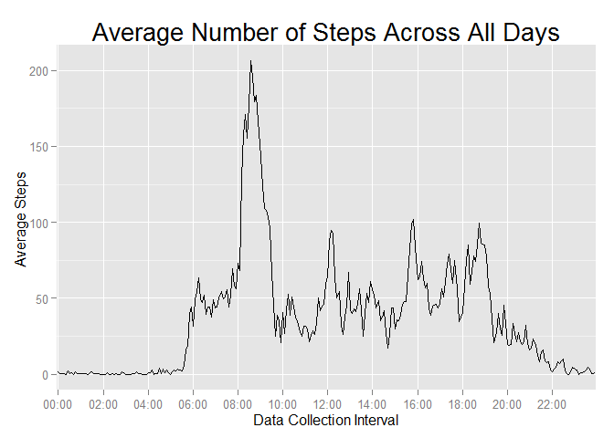
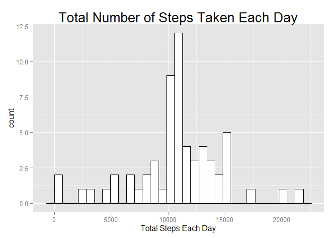
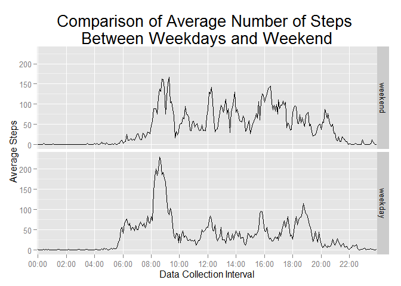

# Reproducible Research: Peer Assessment 1


## Loading and preprocessing the data

```r
## Function definition part
func_totalstepseachday <- function(par_activity){
        totalstepseachday <- with(par_activity, 
                                  tapply(steps, date, sum, na.rm = TRUE))

        totalstepseachdaydf <- data.frame(
                date = as.Date(as.character(names(totalstepseachday))), 
                totalsteps = totalstepseachday)
        
        histbinwidth <- diff(range(totalstepseachdaydf$totalsteps)) / 30
                
        h1 <- ggplot(totalstepseachdaydf, aes(x = totalsteps)) +
                geom_histogram(binwidth = histbinwidth,
                               fill = "white", color = "black") +
                xlab("Total Steps Each Day") +
                ggtitle("Total Number of Steps Taken Each Day")  +
                theme(plot.title = element_text(size = 20))  
        print(h1)
        
        
        meantotalstepseachday <- format(mean(totalstepseachday),digits = 6)
        mediantotalstepseachday <- format(median(totalstepseachday),digits = 6)
        
        print(paste0("The mean total number of steps take per day is : ", 
                     meantotalstepseachday))
        print(paste0("The median total number of steps take per day is : ", 
                     mediantotalstepseachday))
        
}

func_avgstepsperintervaldf <- function(par_activity){
        
        avgstepsperinterval <- with(par_activity, 
                                    tapply(steps, interval, mean, na.rm = TRUE))
        interval <- paste0("000",as.character(names(avgstepsperinterval)))
        interval <- substring(interval, first = nchar(interval) - 3)
        
        avgstepsperintervaldf <- data.frame(
                interval = interval, 
                avgsteps = avgstepsperinterval)
        
        return(avgstepsperintervaldf)
        
}

## Execution part
library(ggplot2)
activity <- read.csv("activity.csv")
```


## What is mean total number of steps taken per day?

```r
func_totalstepseachday(activity)
```

 

```
## [1] "The mean total number of steps take per day is : 9354.23"
## [1] "The median total number of steps take per day is : 10395"
```


## What is the average daily activity pattern?


```r
intervallabelpos <- paste0("0", seq(from = 0,to = 23, by = 2), "00")
intervallabelpos <- substring(intervallabelpos, 
                              first = nchar(intervallabelpos) - 3)

intervallabelupperpart <- substring(intervallabelpos, first = 1, last = 2)
intervallabeldownpart <- substring(intervallabelpos, first = 3, last = 4)
intervallabeltext <- paste0(intervallabelupperpart, ":", intervallabeldownpart)

df_avgstepsperinterval <- func_avgstepsperintervaldf(activity)

h2 <- ggplot(df_avgstepsperinterval, aes(x = interval, y = avgsteps, group = 1)) +
        geom_line() +
        scale_x_discrete(breaks = intervallabelpos, labels = intervallabeltext) +
        xlab("Data Collection Interval") +
        ylab("Average Steps ") +
        ggtitle("Average Number of Steps Across All Days")  +
        theme(plot.title = element_text(size = 20))  

h2
```

 

```r
maxindex <- row.names(df_avgstepsperinterval[which.max(df_avgstepsperinterval$avgsteps),])

print(paste0("The interval containing the maximum number of steps is : ", 
             maxindex))
```

```
## [1] "The interval containing the maximum number of steps is : 835"
```


## Imputing missing values

```r
nasum <- sum(is.na(activity$steps))
print(paste0("The total number of missing values in the dataset is : ", 
             nasum))
```

```
## [1] "The total number of missing values in the dataset is : 2304"
```

**It is considered to use average steps of each interval across all days to replace NA :**


```r
activitytofillNA <- activity
naindex <- which(is.na(activitytofillNA$steps))

intervalindex <- activitytofillNA$interval[naindex]
replacenanumeric <- numeric(length(intervalindex))

for(i in 1:length(intervalindex)){
        findnum <- df_avgstepsperinterval$avgsteps[names(df_avgstepsperinterval$avgsteps) 
                                                  == as.character(intervalindex[i])]
        replacenanumeric[i] <- findnum
}

activitytofillNA$steps[naindex] <- replacenanumeric

func_totalstepseachday(activitytofillNA)
```

 

```
## [1] "The mean total number of steps take per day is : 10766.2"
## [1] "The median total number of steps take per day is : 10766.2"
```


###Comparison
- **The estimates of the mean and median steps in this part differ from the estimates from the first part of the assignment**
- **The estimates of the mean and median steps in this part are both larger than the estimates from the first part of the assignment, and the estimate of the mean increases more than that of the median**
- **In general, the shapes of these two figures are almost similar.But it seems that after imputing missing values, the counts of the values near 0 decreases greatly and the counts of the values near 11000 increases greatly**


## Are there differences in activity patterns between weekdays and weekends?


```r
df_activityaddweekdayfactor <- data.frame(activitytofillNA, 
                                       weekdayfactor = character(nrow(activitytofillNA)),
                                       stringsAsFactors = FALSE)

df_activityaddweekdayfactor$weekdayfactor <- "weekday"
for(i in 1:nrow(df_activityaddweekdayfactor)){
        weekdayvar <- weekdays(as.Date(df_activityaddweekdayfactor[i,2]))
        if(weekdayvar %in% c("Saturday", "Sunday")){
                df_activityaddweekdayfactor$weekdayfactor[i] <- "weekend"
        }
}

df_activityaddweekdayfactor$weekdayfactor <- as.factor(df_activityaddweekdayfactor$weekdayfactor)

df_avgstepsperintervalweekday <- 
        func_avgstepsperintervaldf(df_activityaddweekdayfactor
                                  [as.character(df_activityaddweekdayfactor$weekdayfactor) == 
                                          "weekday", 1:3])
                            
df_avgstepsperintervalweekday <- data.frame(df_avgstepsperintervalweekday, 
                                           weekdayfactor = "weekday", 
                                           stringsAsFactors = FALSE)         

df_avgstepsperintervalweekend <- 
        func_avgstepsperintervaldf(df_activityaddweekdayfactor
                                  [as.character(df_activityaddweekdayfactor$weekdayfactor) == 
                                          "weekend", 1:3])

df_avgstepsperintervalweekend <- data.frame(df_avgstepsperintervalweekend, 
                                           weekdayfactor = "weekend", 
                                           stringsAsFactors = FALSE)        

df_avgstepsperintervalconnected <- rbind(df_avgstepsperintervalweekday,
                                         df_avgstepsperintervalweekend)


h3 <- ggplot(df_avgstepsperintervalconnected, aes(x = interval, y = avgsteps, group = 1)) +
        geom_line() +
        facet_grid(weekdayfactor ~ ., as.table = FALSE) +
        scale_x_discrete(breaks = intervallabelpos, labels = intervallabeltext) +
        xlab("Data Collection Interval") +
        ylab("Average Steps ") +
        ggtitle("Comparison of Average Number of Steps \nBetween Weekdays and Weekend")  +
        theme(plot.title = element_text(size = 20))  

h3
```

 

